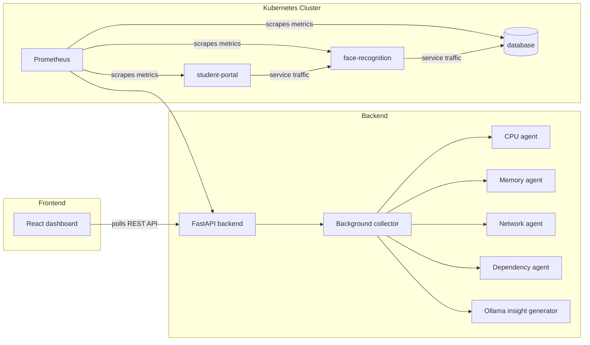

# KubeMind AI

KubeMind AI is a Kubernetes observability and demo platform that combines live cluster metrics, anomaly detection, and local LLM-powered insights in a single dashboard. It is designed to make Kubernetes behavior easy to explain during a demo while still using real infrastructure: Minikube, Prometheus, FastAPI, React, and Ollama.

The project is intentionally built around a clear narrative: watch the cluster, detect abnormal behavior, generate an explanation, and visualize the result in a polished UI.

## Theme and Objective

The theme of the project is **AI-assisted Kubernetes operations**. Instead of only showing raw metrics, KubeMind AI turns those metrics into something actionable and understandable for operators, reviewers, and demo judges.

The main objective is to:

1. Observe live Kubernetes pod metrics.
2. Detect operational anomalies such as CPU spikes, memory leaks, and dependency issues.
3. Use a local LLM through Ollama to generate human-readable incident insights.
4. Present the results in a modern dashboard with charts, dependency visualization, and anomaly history.

## What Problems It Solves

Kubernetes data is usually fragmented across dashboards, logs, and alerts. KubeMind AI addresses that by:

1. Consolidating pod health, anomalies, and service relationships into one place.
2. Translating raw metric spikes into short operational explanations.
3. Providing a live demo flow that is easy to understand without a large amount of Kubernetes background.
4. Keeping the app resilient with fallback logic when Prometheus or Ollama is unavailable.

## Core Features

- Live pod metrics for CPU, memory, restart count, and network traffic.
- Anomaly detection for CPU spikes, high memory, memory leaks, and dependency instability.
- LLM-generated insights for anomalies using Ollama.
- Dependency graph visualization for the deployed services.
- Anomaly timeline for recent events.
- Simulation endpoints for demo scenarios such as CPU spikes and memory pressure.
- Kubernetes deployment manifests for Minikube-based local execution.
- Fallback mock metrics so the dashboard still loads when Prometheus is not ready.

## Functional Overview

### Backend

The backend is a FastAPI service that runs a background collector every 10 seconds. It:

1. Queries Prometheus for pod-level metrics.
2. Runs a set of detection agents against the collected data.
3. Stores anomalies in an in-memory history buffer.
4. Uses Ollama to generate a short insight for each anomaly.
5. Exposes REST endpoints for the frontend.

Available backend endpoints include:

- `GET /health`
- `GET /api/metrics/current`
- `GET /api/anomalies/current`
- `GET /api/anomalies/history?hours=1`
- `GET /api/dependencies`
- `GET /api/recommendations`
- `POST /api/simulate/cpu-spike?pod_name=...`
- `POST /api/simulate/memory-leak?pod_name=...`

### Frontend

The frontend is a React dashboard that polls the backend regularly and renders:

- A top summary bar with live pod count and critical alert count.
- A metrics panel with CPU and memory bars for each pod.
- A dependency graph.
- An AI insights panel for active anomalies.
- An anomaly timeline for recent incidents.

### Kubernetes Layer

The cluster runs three workloads in the `kubemind-demo` namespace:

- `student-portal` deployment with 2 replicas.
- `face-recognition` deployment with 1 replica.
- `database` deployment using `postgres:14-alpine`.

The manifests expose each service as a ClusterIP service so they can communicate internally in the cluster.

## Architecture



### Data Flow

1. Prometheus collects cluster metrics.
2. The backend fetches those metrics into memory.
3. Detection agents classify anomalies.
4. The LLM generates a short explanation for each anomaly.
5. React polls the backend and renders the live state.
6. Demo triggers can artificially spike CPU or memory to prove the full pipeline.

## Repository Structure

```text
kubemind-ai/
├── backend/
│   ├── agents/
│   │   ├── cpu_agent.py
│   │   ├── dependency_agent.py
│   │   ├── memory_agent.py
│   │   └── network_agent.py
│   ├── llm/
│   │   └── insight_generator.py
│   ├── metrics/
│   │   └── prometheus_client.py
│   ├── main.py
│   └── requirements.txt
├── docker/
│   ├── face-recognition/
│   │   ├── app.py
│   │   ├── DockerFile
│   │   └── requirements.txt
│   └── student-portal/
│       ├── app.py
│       ├── DockerFile
│       └── requirements.txt
├── frontend/
│   ├── public/
│   ├── src/
│   │   ├── components/
│   │   ├── App.jsx
│   │   ├── App.css
│   │   └── index.js
│   ├── package.json
│   └── QUICKSTART.md
├── k8s/
│   ├── database.yaml
│   ├── face-recognition.yaml
│   └── student-portal.yaml
├── KubeMind_Windows_Setup_Guide.md
└── README.md
```

## Key Implementation Details

### Backend detection agents

- `CPUAgent` flags CPU usage above 80% and labels very high spikes as critical.
- `MemoryAgent` detects high memory usage and growth-based memory leaks.
- `NetworkAgent` detects inbound and outbound traffic anomalies.
- `DependencyAgent` builds the service relationship view used in the dashboard.

### Insight generation

The backend sends anomaly context and current pod metrics to Ollama. If the model call fails, the system falls back to a template-based explanation so the UI still has content.

The configured model is controlled by the `OLLAMA_MODEL` environment variable. The current default is:

```text
phi3.5:latest
```

## Challenges and Design Tradeoffs

1. **Prometheus may not be ready immediately.** The backend includes mock metric fallback so the UI can still render during startup.
2. **LLM availability depends on a local model.** If Ollama or the model is unavailable, insight generation falls back to templates.
3. **Windows + Minikube requires the correct Docker context.** Docker must be pointed at Minikube before building images.
4. **Cluster data can be delayed.** The dashboard polls periodically, so anomalies and metric changes may take a few seconds to appear.
5. **Demo stability matters.** The app favors visible, readable output over complex but fragile real-time processing.

## Installation and Setup

### Prerequisites

Install these tools first:

- Docker Desktop
- kubectl
- Minikube
- Python 3.10 or newer
- Node.js 18 or newer
- Ollama
- VS Code

### Backend setup

```powershell
cd F:\projects\kubemind-ai\backend
python -m venv .venv
.\.venv\Scripts\Activate.ps1
pip install -r requirements.txt
```

### Frontend setup

```powershell
cd F:\projects\kubemind-ai\frontend
npm install
```

### Ollama setup

Make sure the Ollama desktop app or service is running, then verify the model list:

```powershell
ollama list
```

If you want to install the model used by the backend default, run:

```powershell
ollama pull phi3.5:latest
```

If you prefer another local model, set the environment variable before starting the backend:

```powershell
$env:OLLAMA_MODEL = "your-model-name"
```

## Build and Run

### 1. Start Minikube

```powershell
minikube start --driver=docker
```

### 2. Point Docker to Minikube

Run this in every new PowerShell terminal before building container images:

```powershell
minikube docker-env | Invoke-Expression
```

### 3. Build the images

The Dockerfiles in this repo are named `DockerFile` with a capital `F`, so pass `-f DockerFile` explicitly.

```powershell
cd F:\projects\kubemind-ai\docker\student-portal
docker build -f DockerFile -t kubemind/student-portal:latest .

cd F:\projects\kubemind-ai\docker\face-recognition
docker build -f DockerFile -t kubemind/face-recognition:latest .
```

### 4. Deploy to Kubernetes

```powershell
cd F:\projects\kubemind-ai
kubectl apply -f k8s/student-portal.yaml -n kubemind-demo
kubectl apply -f k8s/face-recognition.yaml -n kubemind-demo
kubectl apply -f k8s/database.yaml -n kubemind-demo
```

If the namespace does not exist yet, create it first:

```powershell
kubectl create namespace kubemind-demo
```

### 5. Start the backend

```powershell
cd F:\projects\kubemind-ai\backend
python main.py
```

### 6. Start the frontend

```powershell
cd F:\projects\kubemind-ai\frontend
npm start
```

### 7. Port-forward Prometheus and demo services

```powershell
kubectl port-forward svc/prometheus-server 9090:80 -n monitoring
kubectl port-forward svc/face-recognition 5002:5000 -n kubemind-demo
```

## Demo Endpoints

The backend exposes trigger endpoints for live demonstrations:

```powershell
Invoke-RestMethod -Method Post -Uri "http://localhost:8000/api/simulate/cpu-spike?pod_name=face-recognition"
Invoke-RestMethod -Method Post -Uri "http://localhost:8000/api/simulate/memory-leak?pod_name=student-portal"
```

Check the current cluster snapshot with:

```powershell
Invoke-RestMethod -Uri "http://localhost:8000/api/metrics/current"
Invoke-RestMethod -Uri "http://localhost:8000/api/anomalies/current"
```

## Useful Demo Flow

1. Open the React dashboard at `http://localhost:3000`.
2. Trigger a CPU spike for `face-recognition`.
3. Wait for the metrics and insight card to update.
4. Trigger a memory leak for `student-portal`.
5. Observe the anomaly timeline and severity styling.
6. Use the dependency graph and recommendations as the explanation layer in the demo.

## Future Improvements

- Add persistent storage for anomaly history so events survive restarts.
- Stream token-by-token responses from Ollama into the UI.
- Add authentication for the API and dashboard.
- Replace mock fallback data with optional real scrape status indicators.
- Add alert delivery through email, Slack, or Teams.
- Expand the agent set with disk, pod scheduling, and ingress-level signals.
- Add a CI/CD pipeline for building and deploying the images automatically.
- Support multiple namespaces and multi-cluster views.

## Troubleshooting

- If Docker builds fail with a missing Dockerfile, make sure you are using `-f DockerFile`.
- If the backend shows Prometheus connection failures, check the `kubectl port-forward` terminal for the `monitoring` namespace.
- If insights look generic, verify Ollama is running and the configured model exists in `ollama list`.
- If the dashboard shows mock data, wait a minute for Prometheus to scrape the pods.
- If Kubernetes pods are pending, make sure Minikube is running and the images were built after `minikube docker-env | Invoke-Expression`.

## Project Summary

KubeMind AI is a local-first Kubernetes observability demo that combines:

- live metrics,
- anomaly detection,
- dependency visualization,
- and LLM-generated operational insights.

It is built to be understandable, impressive in a demo, and realistic enough to reflect the moving parts of a production monitoring workflow.
