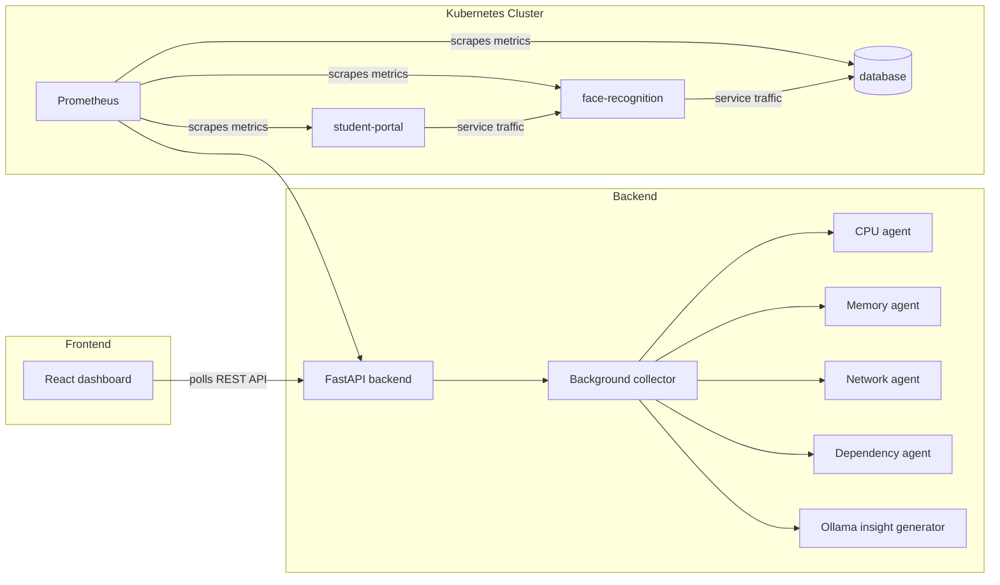

# KubeMind AI

KubeMind AI is a Kubernetes observability and demo platform that combines live cluster metrics, anomaly detection, and local LLM-powered insights in a single dashboard. It is designed to make Kubernetes behavior easy to explain during a demo while still using real infrastructure: Minikube, Prometheus, FastAPI, React, and Ollama.

The project is intentionally built around a clear narrative: watch the cluster, detect abnormal behavior, generate an explanation, and visualize the result in a polished UI.

## Theme and Objective

The theme of the project is **AI-assisted Kubernetes operations**. Instead of only showing raw metrics, KubeMind AI turns those metrics into something actionable and understandable for operators, reviewers, and demo judges.

The main objective is to:

1. Observe live Kubernetes pod metrics.
2. Detect operational anomalies such as CPU spikes, memory leaks, and dependency issues.
3. Use a local LLM through Ollama to generate human-readable incident insights.
4. Present the results in a modern dashboard with charts, dependency visualization, and anomaly history.

## What Problems It Solves

Kubernetes data is usually fragmented across dashboards, logs, and alerts. KubeMind AI addresses that by:

1. Consolidating pod health, anomalies, and service relationships into one place.
2. Translating raw metric spikes into short operational explanations.
3. Providing a live demo flow that is easy to understand without a large amount of Kubernetes background.
4. Keeping the app resilient with fallback logic when Prometheus or Ollama is unavailable.

## Core Features

### Frontend UI & Theme
- **Dark/Light theme toggle** with persistent localStorage and smooth CSS variable transitions.
- **Responsive React dashboard** with Framer Motion animations and real-time data updates.
- **About page** with comprehensive guides on features, metrics, risks, architecture, and technology stack.
- **React Router navigation** between dashboard and documentation pages.

### Observability & Analytics
- Live pod metrics for CPU, memory, restart count, and network traffic.
- Anomaly detection for CPU spikes, high memory, memory leaks, and dependency instability.
- LLM-generated insights for anomalies using Ollama (local, no external API calls).
- Dependency graph visualization for the deployed services.
- Anomaly timeline for recent events with severity classification.
- Health score calculation (A-F grading) for cluster status.
- Predictive forecasting for CPU and memory trends.
- Correlation analysis between pod metrics.

### Operational & Demo Features
- Simulation endpoints for demo scenarios such as CPU spikes and memory pressure.
- Chaos engine with controlled anomaly injection (30-50 second intervals).
- Recommendation engine for operational insights.
- Activity feed for event logging and tracking.
- Kubernetes deployment manifests for Minikube-based local execution.
- Fallback mock metrics so the dashboard still loads when Prometheus is not ready.
- Fast local-only demo mode (quick-start script) for rapid prototyping.

## Functional Overview

### Backend

The backend is a FastAPI service that runs a background collector every 10 seconds. It:

1. Queries Prometheus for pod-level metrics.
2. Runs a set of detection agents against the collected data.
3. Stores anomalies in an in-memory history buffer.
4. Uses Ollama to generate a short insight for each anomaly.
5. Exposes REST endpoints for the frontend.

**Key Endpoints:**
- `GET /health` - Service health check
- `GET /api/metrics/current` - Current pod metrics
- `GET /api/anomalies/current` - Active anomalies
- `GET /api/anomalies/history?hours=1` - Historical anomalies
- `GET /api/dependencies` - Service dependency graph
- `GET /api/recommendations` - Operational recommendations
- `GET /api/forecast` - CPU/memory trend predictions
- `GET /api/correlations` - Metric correlations
- `GET /api/summary/dependencies` - LLM summary of service relationships
- `GET /api/summary/health` - LLM summary of cluster health
- `POST /api/simulate/cpu-spike?pod_name=...` - Trigger CPU spike demo
- `POST /api/simulate/memory-leak?pod_name=...` - Trigger memory leak demo
- `POST /api/chaos/enable` - Enable/disable chaos injection
- `POST /api/chaos/inject` - Manually inject anomalies

### Frontend

The frontend is a React dashboard (React 19) that polls the backend regularly and renders:

- **Header** with live pod count, critical alert badge, and theme toggle button
- **Metrics Panel** with CPU/memory bars and health indicators for each pod
- **Dependency Graph** showing service relationships and communication flow
- **AI Insights Panel** for active anomalies with LLM-generated explanations
- **Health Score** dashboard with cluster grading (A-F scale)
- **Forecast Panel** with trend predictions for CPU and memory usage
- **Anomaly Timeline** showing historical events over the last 60 minutes
- **Correlation Matrix** displaying metric dependencies
- **Chaos Control** panel for triggering demo scenarios and anomaly injection
- **Activity Feed** for event tracking and operational logging
- **Recommendations Panel** with actionable insights based on current state
- **About Page** with comprehensive documentation and guides
- **Theme Toggle** button for dark/light mode switching with persistent storage

**UI Framework Stack:**
- React 19 with functional components and hooks
- Framer Motion for smooth animations and transitions
- Recharts for interactive data visualizations
- React Router v6 for navigation
- Cytoscape.js for dependency graph rendering
- CSS custom properties (variables) for theming

### Kubernetes Layer

The cluster runs three workloads in the `kubemind-demo` namespace:

- `student-portal` deployment with 2 replicas.
- `face-recognition` deployment with 1 replica.
- `database` deployment using `postgres:14-alpine`.

The manifests expose each service as a ClusterIP service so they can communicate internally in the cluster.

## Architecture



### Data Flow

1. Prometheus collects cluster metrics.
2. The backend fetches those metrics into memory.
3. Detection agents classify anomalies.
4. The LLM generates a short explanation for each anomaly.
5. React polls the backend and renders the live state.
6. Demo triggers can artificially spike CPU or memory to prove the full pipeline.

## Repository Structure

```text
kubemind-ai/
├── backend/
│   ├── agents/
│   │   ├── cpu_agent.py
│   │   ├── dependency_agent.py
│   │   ├── memory_agent.py
│   │   └── network_agent.py
│   ├── llm/
│   │   └── insight_generator.py
│   ├── metrics/
│   │   └── prometheus_client.py
│   ├── main.py
│   ├── chaos_engine.py
│   ├── forecasting.py
│   ├── correlation.py
│   ├── recommendations.py
│   └── requirements.txt
├── docker/
│   ├── face-recognition/
│   │   ├── app.py
│   │   ├── DockerFile
│   │   └── requirements.txt
│   └── student-portal/
│       ├── app.py
│       ├── DockerFile
│       └── requirements.txt
├── frontend/
│   ├── public/
│   │   ├── index.html
│   │   ├── manifest.json
│   │   └── robots.txt
│   ├── src/
│   │   ├── components/
│   │   │   ├── MetricsPanel.jsx
│   │   │   ├── DependencyGraph.jsx
│   │   │   ├── InsightsPanel.jsx
│   │   │   ├── AnomalyTimeline.jsx
│   │   │   ├── HealthScore.jsx
│   │   │   ├── ForecastPanel.jsx
│   │   │   ├── CorrelationMatrix.jsx
│   │   │   ├── ChaosControl.jsx
│   │   │   ├── ActivityFeed.jsx
│   │   │   ├── RecommendationsPanel.jsx
│   │   │   ├── CustomCursor.jsx
│   │   │   ├── ParticleBackground.jsx
│   │   │   └── LoadingSkeleton.jsx
│   │   ├── context/
│   │   │   └── ThemeContext.js
│   │   ├── pages/
│   │   │   ├── About.jsx
│   │   │   └── About.css
│   │   ├── App.jsx
│   │   ├── App.css
│   │   ├── animations.css
│   │   ├── index.css
│   │   ├── index.js
│   │   └── setupTests.js
│   ├── package.json
│   ├── QUICKSTART.md
│   └── README.md
├── k8s/
│   ├── database.yaml
│   ├── face-recognition.yaml
│   └── student-portal.yaml
├── scripts/
│   ├── quick-start.ps1
│   ├── start-all.ps1
│   ├── stop-all.ps1
│   └── logs/
├── KubeMind_Windows_Setup_Guide.md
└── README.md
```

## Key Implementation Details

### Backend Components

**Detection Agents:**
- `CPUAgent` flags CPU usage above 80% and labels very high spikes as critical.
- `MemoryAgent` detects high memory usage and growth-based memory leaks.
- `NetworkAgent` detects inbound and outbound traffic anomalies.
- `DependencyAgent` builds the service relationship view used in the dashboard.

**Specialized Modules:**
- `ChaosEngine` injects controlled failures at 30-50 second intervals for demo scenarios.
- `ForecastingEngine` uses polyfit to predict CPU and memory trends (10-minute horizon).
- `CorrelationAnalyzer` identifies metric dependencies between pods.
- `RecommendationEngine` generates actionable operational suggestions.
- `InsightGenerator` (Ollama LLM) creates human-readable summaries of incidents.

### Frontend Architecture

**Theme System:**
- `ThemeContext` manages global dark/light theme state with localStorage persistence.
- CSS custom properties (variables) enable theme switching without component re-renders.
- Supported themes: Dark (default) and Light with full color palette definitions.

**Routing & Navigation:**
- React Router v6 enables navigation between dashboard and About page.
- `BrowserRouter` wraps the entire application.
- Theme toggle button persists across all routes.

**Dashboard Components:**
Each component is a self-contained module that:
- Polls its specific backend endpoint on a fixed interval.
- Handles loading and error states independently.
- Uses Framer Motion for entrance and interaction animations.
- Respects theme variables for styling consistency.

**About Page:**
- Comprehensive guide with 8 sections: Overview, Features, Metrics Explained, Risks & Alerts, Architecture, Technology Stack, Quick Start, and Footer.
- Each section includes detailed explanations and visual components (cards, grids, badges).
- Responsive design with mobile-optimized layouts.
- Animated entrance with staggered child animations.

### Insight Generation

The backend sends anomaly context and current pod metrics to Ollama. If the model call fails, the system falls back to a template-based explanation so the UI still has content.

The configured model is controlled by the `OLLAMA_MODEL` environment variable. The current default is:

```text
phi3.5:latest
```

### Chaos Engine

The chaos engine runs a background loop that:
1. Injects random anomalies (CPU spike, memory leak, network burst, I/O spike) every 30-50 seconds.
2. Auto-recovers after 2-3 minutes to simulate incident resolution.
3. Logs all injections to console for operator visibility.
4. Can be enabled/disabled via API endpoint.

## Challenges and Design Tradeoffs

1. **Prometheus may not be ready immediately.** The backend includes mock metric fallback so the UI can still render during startup.
2. **LLM availability depends on a local model.** If Ollama or the model is unavailable, insight generation falls back to templates.
3. **Windows + Minikube requires the correct Docker context.** Docker must be pointed at Minikube before building images.
4. **Cluster data can be delayed.** The dashboard polls periodically, so anomalies and metric changes may take a few seconds to appear.
5. **Demo stability matters.** The app favors visible, readable output over complex but fragile real-time processing.
6. **Theme persistence uses localStorage.** Works for individual browser sessions but does not sync across devices.
7. **Anomaly history is in-memory.** Survives while the backend is running but is lost on restart. Future versions could use Redis or PostgreSQL.
8. **Chaos injection interval is fixed randomly.** To make anomalies feel less predictable during demos, intervals vary between 30-50 seconds instead of being constant.
9. **No authentication layer.** The demo assumes a trusted local network; production use should add OAuth or API key validation.

## Installation and Setup

### Prerequisites

Install these tools first:

- Docker Desktop
- kubectl
- Minikube
- Python 3.10 or newer
- Node.js 18 or newer
- Ollama
- VS Code

### Backend setup

```powershell
cd F:\projects\kubemind-ai\backend
python -m venv .venv
.\.venv\Scripts\Activate.ps1
pip install -r requirements.txt
```

### Frontend setup

```powershell
cd F:\projects\kubemind-ai\frontend
npm install
```

### Ollama setup

Make sure the Ollama desktop app or service is running, then verify the model list:

```powershell
ollama list
```

If you want to install the model used by the backend default, run:

```powershell
ollama pull phi3.5:latest
```

If you prefer another local model, set the environment variable before starting the backend:

```powershell
$env:OLLAMA_MODEL = "your-model-name"
```

## Build and Run

### Quick Start (Recommended for Demos)

For fast local-only demos without Kubernetes overhead, use the quick-start script:

```powershell
cd F:\projects\kubemind-ai
.\scripts\quick-start.ps1
```

This will:
1. Start the FastAPI backend on port 8000
2. Start the React frontend on port 3000
3. Start the Ollama LLM service
4. Log all output to `scripts/logs/`

Open `http://localhost:3000` to see the live dashboard.

**To stop all services:**
```powershell
.\scripts\stop-all.ps1
```

### Developer Checks & Tests

Before committing changes, run the simple checks below to keep quality consistent:

Backend (run from repo root):

```powershell
cd backend
pytest
```

Frontend (light lint + tests):

```bash
cd frontend
npm run lint    # quick eslint pass (may be no-op if eslint is not installed)
npm test        # runs Create React App tests (interactive)
```

For CI-style runs you can use:

```bash
cd frontend
npm run test:ci
```

Note: the anomaly history is kept in-memory on the backend. If a pod or backend process restarts, the in-memory history (and its replayable events) will be lost; the system will continue collecting new metrics and anomalies after restart. Consider adding Redis or a small DB for persistent history in the future.

### Full Kubernetes Deployment

For the complete multi-pod Kubernetes experience:

#### 1. Start Minikube

```powershell
minikube start --driver=docker
```

#### 2. Point Docker to Minikube

Run this in every new PowerShell terminal before building container images:

```powershell
minikube docker-env | Invoke-Expression
```

#### 3. Build the images

The Dockerfiles in this repo are named `DockerFile` with a capital `F`, so pass `-f DockerFile` explicitly.

```powershell
cd F:\projects\kubemind-ai\docker\student-portal
docker build -f DockerFile -t kubemind/student-portal:latest .

cd F:\projects\kubemind-ai\docker\face-recognition
docker build -f DockerFile -t kubemind/face-recognition:latest .
```

#### 4. Deploy to Kubernetes

```powershell
cd F:\projects\kubemind-ai
kubectl apply -f k8s/student-portal.yaml -n kubemind-demo
kubectl apply -f k8s/face-recognition.yaml -n kubemind-demo
kubectl apply -f k8s/database.yaml -n kubemind-demo
```

If the namespace does not exist yet, create it first:

```powershell
kubectl create namespace kubemind-demo
```

#### 5. Start the backend

```powershell
cd F:\projects\kubemind-ai\backend
python main.py
```

#### 6. Start the frontend

```powershell
cd F:\projects\kubemind-ai\frontend
npm start
```

#### 7. Port-forward Prometheus and demo services

```powershell
kubectl port-forward svc/prometheus-server 9090:80 -n monitoring
kubectl port-forward svc/face-recognition 5002:5000 -n kubemind-demo
```

Open `http://localhost:3000` to see the live dashboard.

## Demo Endpoints and Controls

### API Trigger Endpoints

The backend exposes trigger endpoints for live demonstrations:

```powershell
# Trigger a CPU spike
Invoke-RestMethod -Method Post -Uri "http://localhost:8000/api/simulate/cpu-spike?pod_name=face-recognition"

# Trigger a memory leak
Invoke-RestMethod -Method Post -Uri "http://localhost:8000/api/simulate/memory-leak?pod_name=student-portal"

# Enable/disable chaos injection
Invoke-RestMethod -Method Post -Uri "http://localhost:8000/api/chaos/enable"

# Inject a random anomaly
Invoke-RestMethod -Method Post -Uri "http://localhost:8000/api/chaos/inject"
```

### Dashboard Controls

**Theme Toggle:**
- Click the **☀️ / 🌙 button** in the bottom-right corner to switch between dark and light modes.
- Theme preference is saved to browser localStorage and persists across sessions.

**About Page:**
- Click the **ⓘ About link** in the header to view comprehensive documentation.
- Includes feature guide, metrics explanation, risk levels, architecture overview, and technology stack.

**Chaos Control Panel:**
- Use the **⚡ Inject Now** button to manually trigger anomalies.
- Enable/disable automatic chaos injection to control demo flow.

### Real-Time Metrics

Check the current cluster snapshot with:

```powershell
# Get current metrics
Invoke-RestMethod -Uri "http://localhost:8000/api/metrics/current"

# Get active anomalies
Invoke-RestMethod -Uri "http://localhost:8000/api/anomalies/current"

# Get LLM-generated summaries
Invoke-RestMethod -Uri "http://localhost:8000/api/summary/dependencies"
Invoke-RestMethod -Uri "http://localhost:8000/api/summary/health"

# Get forecasted trends
Invoke-RestMethod -Uri "http://localhost:8000/api/forecast"

# Get metric correlations
Invoke-RestMethod -Uri "http://localhost:8000/api/correlations"

# Get recommendations
Invoke-RestMethod -Uri "http://localhost:8000/api/recommendations"
```

## Useful Demo Flow

### Step-by-Step Demo Walkthrough

1. **Open the Dashboard**
   - Navigate to `http://localhost:3000`
   - Observe the real-time metrics panel with CPU and memory usage
   - Note the pod count and live indicator in the header

2. **Show the About Page**
   - Click the **ⓘ About** link in the header
   - Walk through the features, metrics explained, and risk levels sections
   - Explain the technology stack and architecture
   - Navigate back to dashboard using the back button

3. **Demonstrate Theme Toggle**
   - Click the **☀️ button** (bottom-right) to switch to light mode
   - Highlight the smooth theme transition
   - Click again to return to dark mode
   - Explain that theme preference persists across sessions

4. **Trigger a CPU Spike**
   - Use the Chaos Control panel's **⚡ Inject Now** button, or
   - Run: `Invoke-RestMethod -Method Post -Uri "http://localhost:8000/api/simulate/cpu-spike?pod_name=face-recognition"`
   - Watch the metrics update in real-time
   - Observe the CPU bar change color (green → orange → red)
   - Check the AI Insights panel for LLM-generated explanation

5. **Trigger a Memory Leak**
   - Click **⚡ Inject Now** again or use memory-leak endpoint
   - Observe gradual memory increase over 2-3 minutes
   - Check the Anomaly Timeline for event history
   - Note how severity badges change color

6. **Examine Correlations**
   - Look at the Correlation Matrix to see metric relationships
   - Point out dependencies between pods
   - Use the Dependency Graph to show service topology

7. **Review Forecasting**
   - Check the Forecast Panel for trend predictions
   - Explain how polyfit extrapolates 10 minutes ahead
   - Show predicted threshold crossings

8. **Operational Insights**
   - Point to the Health Score (A-F grading)
   - Review the Recommendations panel for actionable items
   - Check the Activity Feed for event logging
   - Access the /docs endpoint to show API documentation

9. **Close with Architecture**
   - Re-open About page if needed
   - Walk through the architecture diagram
   - Explain the full pipeline: metrics → detection → LLM → UI
   - Emphasize no external API dependencies (local Ollama)

## Future Improvements

### Short-term Enhancements
- Add metric history endpoint to support line charts in MetricsPanel
- Integrate LLM summaries into frontend dependency and health panels
- Add anomaly severity indicators (color-coded badges) in timeline
- Implement metric export (CSV/JSON) for analysis
- Add anomaly replay from history (re-trigger past scenarios)

### Medium-term Features
- Add persistent storage for anomaly history (Redis or PostgreSQL)
- Stream token-by-token responses from Ollama into the UI
- Add authentication for the API and dashboard (OAuth 2.0)
- Replace mock fallback data with optional real scrape status indicators
- Add alert delivery through email, Slack, Teams, or webhooks
- Expand the agent set with disk, pod scheduling, and ingress-level signals
- Create configurable alert rules and thresholds

### Long-term Roadmap
- Multi-cluster support with cluster selector
- Custom dashboard layouts and widget configuration
- Real-time metric streaming (WebSocket instead of polling)
- Advanced forecasting with ARIMA and Prophet models
- Machine learning-based anomaly detection (isolation forest, autoencoders)
- Cost analysis and resource optimization recommendations
- Incident runbook automation and remediation actions
- Integration with CI/CD pipelines (GitOps workflows)
- Add a CI/CD pipeline for building and deploying the images automatically
- Support multiple namespaces and namespace isolation
- Helm charts for easy production deployment

## Recent Updates (v2.0)

### UI & Navigation
- ✨ **Theme Toggle** - Dark/light mode switching with persistent localStorage
- 🧭 **React Router** - Navigation between dashboard and About page
- 📖 **About Page** - Comprehensive documentation with features, metrics guide, architecture, and tech stack
- 🎨 **Enhanced CSS** - Full light theme support with CSS variable system

### Backend Enhancements
- 📊 **LLM Summary Endpoints** - `/api/summary/dependencies` and `/api/summary/health` for AI-powered cluster insights
- ⚡ **Faster Chaos** - Reduced anomaly injection interval from 120-300s to 30-50s for snappier demos
- 📈 **Extended API** - New endpoints for forecast, correlations, and summaries

### Component Improvements
- 🎭 **Framer Motion Animations** - Smooth entrance animations for all dashboard sections
- 📱 **Responsive Design** - Mobile-friendly layouts across all pages
- 🎯 **Better UX** - Improved loading states, error handling, and visual feedback

### Developer Experience
- 🚀 **Quick-start Script** - `quick-start.ps1` for local-only demo without Kubernetes
- 📦 **Dependencies** - Added react-router-dom (v6.28.0) for routing
- 📝 **Documentation** - Updated README with comprehensive setup and demo guides

## Troubleshooting

- If Docker builds fail with a missing Dockerfile, make sure you are using `-f DockerFile`.
- If the backend shows Prometheus connection failures, check the `kubectl port-forward` terminal for the `monitoring` namespace.
- If insights look generic, verify Ollama is running and the configured model exists in `ollama list`.
- If the dashboard shows mock data, wait a minute for Prometheus to scrape the pods.
- If Kubernetes pods are pending, make sure Minikube is running and the images were built after `minikube docker-env | Invoke-Expression`.

## Project Summary

KubeMind AI is a local-first Kubernetes observability demo that combines:

- live metrics,
- anomaly detection,
- dependency visualization,
- and LLM-generated operational insights.

It is built to be understandable, impressive in a demo, and realistic enough to reflect the moving parts of a production monitoring workflow.
